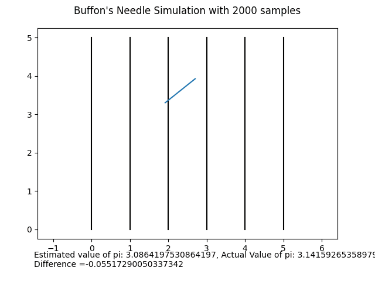

# monte_carlo_notebooks
Learning about the Monte Carlo method.

## Estimating Pi

https://en.wikipedia.org/wiki/Monte_Carlo_method#Overview

Pi ($\pi$) can be estimated by plotting points randomly in a 1x1 square counting how many points fall inside of a unit circle.

The ratio of the areas of the circle and square, is $\frac{\pi}{4}$

So that,

$$
\pi = \frac{4 \times \text{circle count}}{ \text{total count} }
$$

## Buffon's Needle Problem

https://en.wikipedia.org/wiki/Buffon%27s_needle_problem

This method also gives an estimation of pi, due to the rotational symmetry of the needles' orientation.

